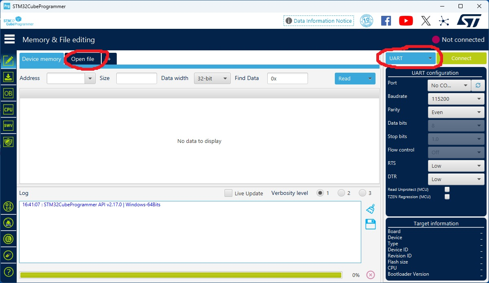
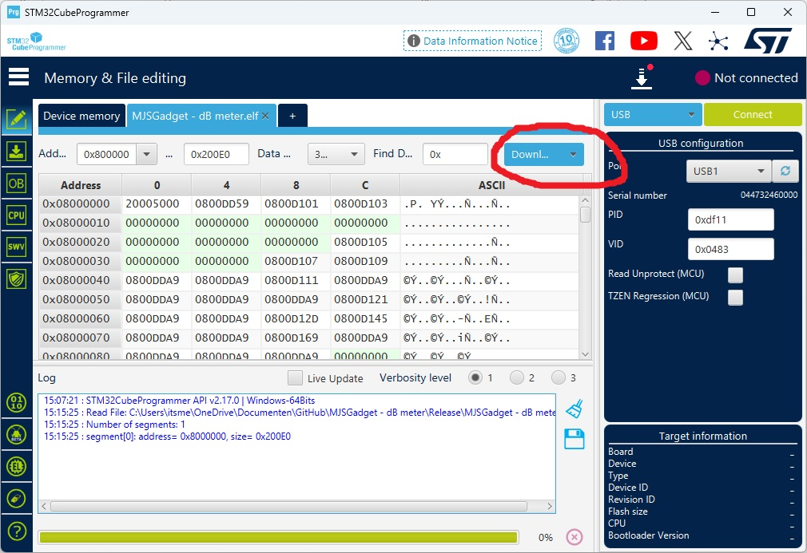
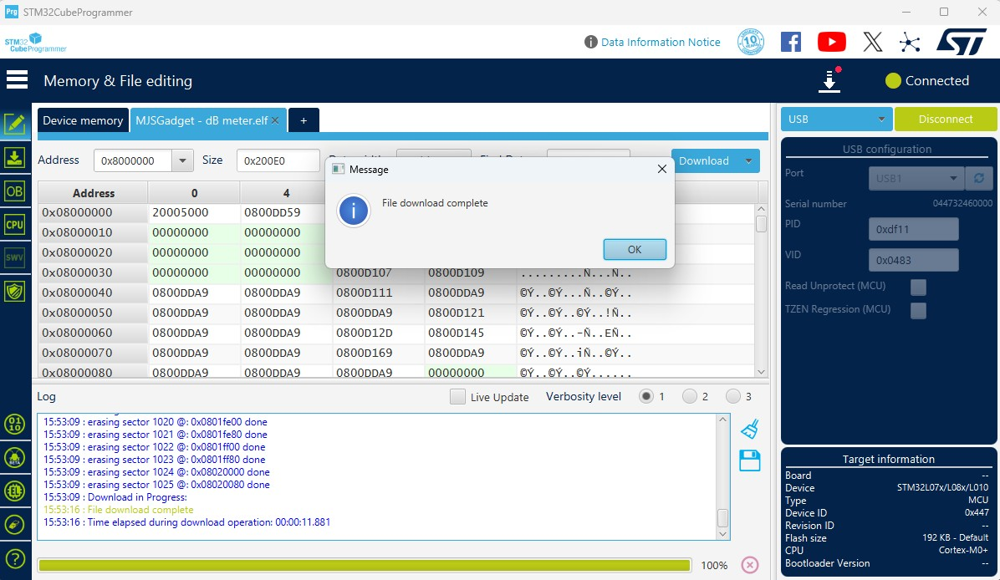
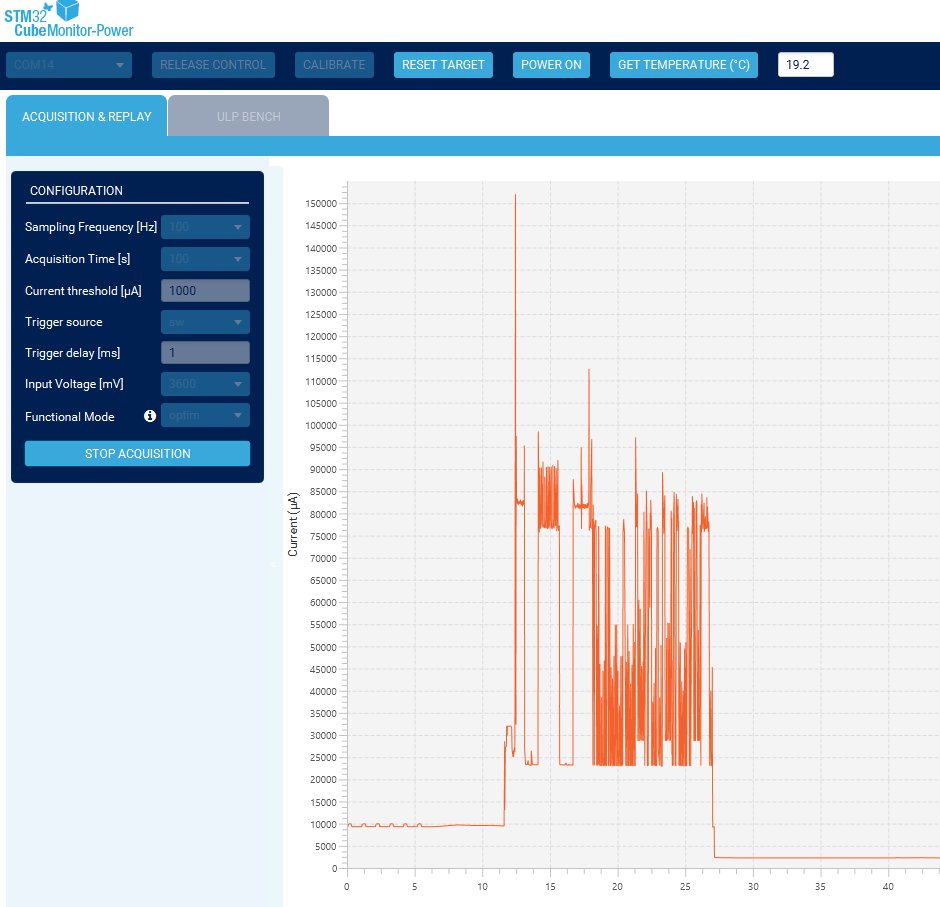
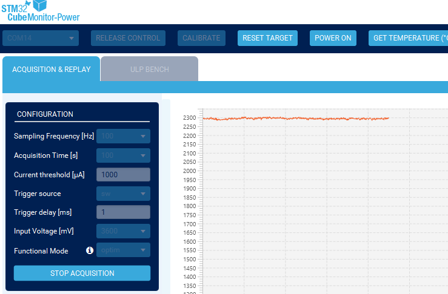

**Table of Contents**

[Introduction](#Introduction)\
[Compiling and building](#Compiling)\
[Programming the omgevingsmonitor with STM32CubeProgrammer](#Programming)\
[Current consumption of the Omgevingsmonitor](#Consumption)\
[version 5.00](#version500)\
[version 4.67](#version467)\
[version 4.66](#version466)\
[version 4.65](#version465)\
[version 4.64](#version464)\
[version 4.63](#version463)\
[version 4.62](#version462)\
[version 4.61](#version461)\
[version 4.60](#version460)\
[version 4.59](#version459)\
[version 4.58](#version458)\
[version 4.57](#version457)\
[version 4.56](#version456)\
[version 4.55](#version455)\
[version 4.54](#version454)\
[version 4.53](#version453)\
[version 4.52](#version452)\
[version 4.51](#version451)\
[version 4.50](#version450)\
[version 4.40](#version440)\
[version 4.39](#version439)\
[version 4.38](#version438)\
[version 4.37](#version437)\
[version 4.36](#version436)\
[version 4.35](#version435)\
[version 4.34](#version434)\
[version 4.33](#version433)\
[version 4.32](#version432)\
[version 4.31](#version431)\
[version 4.3](#version43)\
[version 4.2](#version42)\
[version 4.01](#version401)\
[version 4.0](#version40)\
[version 3.91](#version391)\
[version 3.71](#version371)\
[Version 3.7](#version37)\
[Version 3.5](#version35)\
[Version 3.4](#version34)\
[Known issues](#Known)\
[License](#License)

Find more information at:
https://wiki.deomgevingsmonitor.nl/index.php/Main_Page

## Introduction 
This release makes it possible to operate the Omgevings Monitor (OM) independently of USB power for a longer period >> days. Needless to write, this depends on the ambient temperature and the amount of daylight that the solar panel receives. In battery operation the status LED will flash briefly 3 to 4 times while measurements are being carried out. Green means the battery has sufficient charge. If the LED flashes red during measurement the remaining charge level is approximately 20%, the battery needs to be charged. The measurements are carried out once every 15 minutes in battery operation.

It is possible to use the OM as a handheld by using the BOOT0 button in case of battery operation. The OM then wakes up from energy saving mode. This becomes visible by the lighting of the LEDs. By pressing the user button, the LEDs go out again and the OM starts operating in energy saving mode again. This can take up to about 45 seconds.\
If the battery is low, the system will enter a very low energy state and will not operate normal until the battery is charged. By pressing the reset button while charging, the device becomes operational again. 
As long as there is some energy in the battery, it is possible that the device will start up briefly and then go back into battery protection mode.

The dB LED has the following meaning, more or less in the order of the rainbow:
- dBA >= 90 white
- dBA >= 80 - dBA < 90 red
- dBA >= 70 - dBA < 80 yellow
- dBA >= 60 - dBA < 70 green
- dBA >= 50 - dBA < 60 light blue
- dBA >= 40 - dBA < 50 blue
- dBA >= 35 - dBA < 40 purple
- dBA < 35 LED off, equals to noise level of the microphone

Other LED indications different from the original meaning:
3 flashing red LEDs, communication error with ESP32 => Reboot device by pressing reboot button for at least 3 seconds.
3 flashing blu LEDs, error reading barometric sensor if installed. Without rebooting this can persist over a longer period.
When operating on batterypower, the system wakes about every 15 minutes. When flashing green the charge status is ok, when flashing red the battery status is below 20%. Recharge by USB if possible.
When operating on batterypower, and the system has been waken up by the boot button (i.e. the LEDs are active) pressing the user button the VOC LED lights up white for 1,5 sec to acknowledge the system switches to sleep mode.
When een SEN54 or SEN55 is installed, pressing the userbuttton for at least 2 seconds PM measurement is disabled. Only VOC and in case of a connected SEN55 NOx is measured. The VOC LED flashes one time red for 400ms.

## Compiling and building 
The project was developed with STM32CubeIDE 1.16.1, but also builds in STM32CubeIDE Version: 1.17.0

The project has two build configurations: Debug & Release.\
Select the option under Project -> Build configurations -> Set Active

For installation the STM32CubeIDE follow the procedure under ["Compileren en bouwen"](https://wiki.deomgevingsmonitor.nl/index.php/Programmeeromgeving).

The installation of the sources in the IDE differs slightly from the procedure described on the previously mentioned page.

Under Ubuntu Linux I encountered problems downloading the necessary firmware automatically. The possibility to login by selecting Help -> STM32Cube updates -> Connection to myST -> Enter myST account information shows no dialog. If necessary, download and install it manually in advance. The firmware can be found under ["get stm32l072RZTX firmware"](https://www.st.com/en/embedded-software/stm32cubel0.html#get-software). Install first the "STM32Cube MCU Package for STM32L0 series 1.20.0" in the folder "~/STM32Cube/Repository". Second copy the "Patch for STM32CubeL0" over the installad package. If you know the solution for configuring the STM32CubeIDE so that it automatically downloads the necessary packages, please mention it in an issue of this repo.

Get the sources by using git or download the software as a zip file. Here the procedure is described based on a zip file.

Place the unzipped sources in your working directory of STM32CubeIDE.

For clearity rename the source folder to MJSGadget - dB meter. 

Start STM32CubeIDE\
If this is the first time that STM32CubeIDE is used, choose the 'Import Project' option. Otherwise
- Select File -> Open Projects from File System. Select your source folder MJSGadget - dB Meter. 
- Uncheck the "Search for nested projects". Leave the rest of the settings in the "Import Projects from File System or Archive" unchanged. 
- Click Finish

If you are under Windows and not logged in to ST in the IDE, login to myST first. (Under Ubuntu Linux this is an issue for me. For this reason, the firmware was manually installed earlier in this procedure.)

In the Project Explorer double click on the file 'MJSGadget  - dB meter.ioc'.* (On linux, when the Pinout view is not shown, close the tab and reopen the ioc file.)\
When the 'New STM32Cube firmware version available' dialog is shown, choose 'Continue'.\
After the 'MJSGadget - dB meter.ioc' window has opened, click (in the left column) on 'Middleware and Software Packs'.\
Click on USB_DEVICE. If everything is correct, there is a green check mark in front of USB_DEVICE. 

Click in the ribbon of the IDE on the button 'Device Configuration Tool Code Generation' (icon with yellow wheel) 

Click Yes in the "Open Associated Perpective?"dialog.

After the configuration process unfortunately, a number of necessary files are deleted. 

Therefore, perform the following steps:

- Go to the folder C:\Users\<user>\STM32Cube\Repository\STM32Cube_FW_L0_V1.12.2\Drivers\CMSIS\DSP
- Select the folder Include and use Ctrl-C to copy the contents
- In the Project Explorer select the folder Drivers/CMSIS/DSP and use Ctrl-V
- Go to the folder C:\Users\<user>\STM32Cube\Repository\STM32Cube_FW_L0_V1.12.2\Drivers\CMSIS
- Select the folder Lib and use Ctrl-C to copy the contents.
- In the Project Explorer select the folder Drivers/CMSIS and use Ctrl-V
- (For Linux the folders can be found under ~/STM32Cube/Repository/STM32Cube_FW_L0_V1.12.0/Drivers/CMSIS.)

Execute Project -> Clean.

Check 'Start a build immediately' and choose 'Clean'.

##Programming the omgevingsmonitor with STM32CubeProgrammer 
Prerequisites:
- The path to the *.elf file, f.i. MJSGadget - dB meter.elf. The .elf file contains the firmware for the STM32.
- Installed STM32CubeProgrammer. You can download it from https://www.st.com/en/development-tools/stm32cubeprog.html#overview.
- A USB-C cable to a USB port on your PC/laptop.

Connect the omgevingsmonitor to the USB port.
Press the RESET button, while pressing the RESET button press the BOOT button too. Release the RESET button while holding the BOOT button. Release the BOOT button.

Start the STM32CubeProgrammer.

Press the blue UART button and select USB. USB1 will now appear below the blue button. If "No DFU" is displayed, repeat the button procedure and refresh with the button next to "No DFU."
Press the "Open file" tab, navigate to the location of the elf file and open the file. The *.elf files are typically located in the Debug and Release folders. It is also possible to just download the "MJSGadget - dB meter.elf" file from the folder in the GitHub repository. Please ensure the file is at least 200kB.

Select "Download".
Wait for the ready dialog

Press the RESET button of the Omgevingsmonitor for at least 2 seconds and release the. The omgevingsmonitor should now start with LED patterns.
It is possible to interact with the omgevingsmonitor using Putty or TeraTerm. The omgevingsmonitor must be awake for generating a comport on the host PC.
While the virtual USB comport is active, type Helpme for more information.

## Current consumption of the Omgevingsmonitor 

## version 5.00 
EEPROM memory aligned with v2.0 relase from KITT. USB logging reimplemented. The compiler flag for USBLOGGING is depricated. Standard is logging to USB possible. Make a connection with your PC and use e.g. Putty or Teraterm. 
Switch logging by pressing L (case sensitive!) for logging to USB. 

## version 4.67 
Fix for startup when USBLOGGING is enabled and no USB host is connected. Sending mail added when battery is about 20%. 
Sending an email is implemented by calling the mail API from SMTP2GO.
To get is up and running a free account by SMTP2 necessary.
Sending email requires a free account with SMTP2GO.com, as well as the ability to create a DKIM entry in the DNS domain from which the email will be sent. 
In short: create an API key with SMTP2GO under Account -> Sending -> API Keys. Register the DNS domain from which the email will be sent under Verified Senders. 
Click on the created domain and copy the three CNAME records. Have the DNS administrator add these records. 
You can also use a domain managed at freeDNS. The administrator will add these records if you request them via email and your reputation is not compromised.
To program the email functionality in the omgevingsmonitor, use the USB port. 
The omgevingsmonitor has to execute an image without USBLOGGING, either the release or debug build. 
Connect the omgevingsmonitor to a PC and open the COM port with Putty or Teraterm. 
Type "Helpme" for instructions. You can now use the commands S25, S26, and S27 as from the shown examples to enter the "from" address, the "to" address, and the API key. 
Commands are case sensistive. 
Of non importance from start of version 4.68:
It's essential that an image is loaded without USB logging. 
The definition for this, which needs to be commented out, is in the file usbd_cdc_if.h; comment out the line by starting it with //.

## version 4.66 
Some minor changes, no stability issues

## version 4.65 
fix for red LED off in case of error with 3 LED on

## version 4.64 
solution for disabled AHT2x sensor, which resulted in a hanging system.

## version 4.63 
When battery is full and sun is shining upload every 5 minutes.

## version 4.62 
DST implemented.

## version 4.61 
Under rare circumstances, an error can occur on the I2C bus to which a SEN5x is connected. The sensors of the SEN5x can then no longer be read. This seems to occur if the power of the USB-C is interrupted during a measurement. The handling of read errors of the SEN5x has been made more robust.
The release build variant is now testing, because the maximum programm size is nearly reached for the debug build.

## version 4.60 
A possibility has been created to see the uptime of the OM in opensensemap. Because this is a primitive representation, this is not included in the standard build. It is necessary that the PUBLIC directive is commented out in main.h. By hiding the PUBLIC directive, a file cred.h is expected during the build that must contain the ssid and password of the local WLAN. For the content and format check cred_pub.h. This also ensures that the ESP loses the credentials after a configuration change, upload of new firmware or reset. It is necessary that a sensor is created in opensensemap. The key of this sensor must also be programmed in the OM. This programming can be done by connecting putty or teraterm to the USB-C connector of the OM. Type in helpme or a number of other random letters. The key is displayed at position 25.

## version 4.59 
Bugfix for blue LEDs during read error BMP280

## version 4.58 
Bugfixing for BMP280 which prevented proper waking from sleep mode and returning to sleep mode.

## version 4.57 
Fixes for manually input keys from opensensemap.org. The USB input keeps buggy. But this is only for emergency key input without reprogramming the whole box or people who want to add sensors which are not supported in de default configuration. If the input hangs, just reset the box. Sensors of SEN54/55 added to upload to opensensemap.org.

## version 4.56 
Many small adjustments to improve reliability when switching operating modes. All output of sensors that can be additionally connected to the 3V3 I2C bus are uploaded in the case of a valid opensensemap key, which can be entered via USB.

## version 4.55 
Some bugfixes, auto detect alternate address ENS160.

## version 4.54 
ENS160 sensor added. Basic frame work is included. The usefulness of this sensor can be disputed as long as it is in the housing. Converting the values ​​of the GPR registers to the respective gases is of little use without a good reference  ronment. The values ​​of the AHT21 on the same PCB are used for the temperature compensation of the ENS160.

## version 4.53 
aht20.% renamed to aht2x.%. Version should support AHT20 and AHT21.

## version 4.52 
Minor improvements/fixes. It was necessary that the entire key length input was contained within 1 USB host poll. Because only a cut & paste led to a successful change in EEPROM, this has been adjusted. All logging regarding keys is also sent to the serial log port. The logging output of a line to USB is now always sent within a maximum of 1 USB-A host poll period in the default configuration (no USB logging selected during compilation). This prevents distorted output.

## version 4.51 
The airpressure value is now uploaded to opensensemap.org. The hPa sensor created afterwards in opensensemap can be added by connecting a terminal program directly to the USB-C connector of the OmgevingsMonitor. Enter a number of characters, for example, HelpMe. If the sensor key in opensensemap.org is completely different, the command $5,here_the_sensorid can be executed. For a key where only the last two characters differ from the boxid, #5,xx can be used. 

## version 4.50 
Added support for AHT20 en BMP280 Digital Pressure Sensor, I2C locking changed for 4 sensors 

## version 4.40 
Comment for NTP corrected

## version 4.39 
Some hardcoded values moved to definitions, when battery fully charged PM measurement is enabled every cycle on batterypower (15 minutes) When charge is below 4.0V, PM measurement is only executed every 30 minutes. IDs stored in EEPROM can be shown on UART and USB 

## version 4.38 
Bug fix for continious usb powered systems with a sen5x attached. System stalls PM measurements after fan cleaning.

## version 4.37 
Pin swapping of UART1 disabled to be compatible with FTDI pinout.

## version 4.36 
The ability to correct a sensor ID via USB. Type helpme into the usn virtual com port for an explanation.

## version 4.35 
Version to demonstrate the difference in overhead that deomgevingsmonitor.nl causes compared to opensensemap.org based on the definition #define OPENSENSEMAP in ESP.h. 
To maintain full compatibility, this definition is disabled. 

## version 4.34 
Fix for datagram when on batterypower and sen55 is attached. NodeRED datagram fix

## version 4.33 
Memory for message array optimized in ESP.c. Typo corrected in PC_Config. Customname is limited to 32 chars (was 30). Invalid directories removed from project file.
 
## version 4.32 
Optimizing the datagram to be send and when operating on battery send only PM when PM measurement is active. Preventing cleared values upload during the cycle PM measurement is not executed. NOx values are only uploaded when operated on USB power.

## version 4.31 
Building on fresh Ubuntu verified. Readme instruction supplemented and corrected. Some files renamed to lower case and aligned with the sourcefiles.

## version 4.3 
Various fixes to better handle error handling in different conditions. Feedback when the user button is pressed by the VOC LED, which then lights up white briefly. The 128x64 OLED display is optionally added to the I2C2 bus. This option is disabled by default in the build.

## version 4.2 
Optional display can be compiled for local display of values. (still in development) The define directive "#define SSD1306" is located at about line 24 in ssd1306_128x64_i2c.h

## version 4.01 
Correction for LED color on low battery and some clean up.

## version 4.0 
USB monitoring is possible bij defining USBLOGGING, approximately at line 55, in usbd_cdc_if.h. This has an effect on the inrush current that is inexplicable to me, making it impossible for me to measure the current consumption during code execution and during stop mode. For this reason, the directive is disabled by default.

## version 3.91 
fix voor local build. The project was nested with another project in the debug configuration. This has been fixed.

## version 3.71 
fix for reset timeoutcntr

## version 3.7 
When USB powered and a sen54 or sen55 is connected the on-board SGP40 is disabled. VOC is handled by the sen54/55 module. Due to the VOC algorithm of the sen5x the value is reset after every powercycle. Therefore the SGP40 is enabled when operated on batterypower. When a sen54 or sen55 is attached, a mode is added that the PM measurement is disabled, but the VOC index, temperature and NOx is measured. This mode is selected by press and hold the userbuttton for 2 seconds. This mode uses less power than continious PM measurement, but it is not an energy saving mode. The battery is empty in less than a day. When the capacity is below approx. 40% the sen5x is switched off.  The VOC LED flashes green when selected and red when PM enabled again. When operating on battery the sensors are switched off before sending the datagram by WiFi. Status turns white when PM measurement is executed.

## version 3.5 
Source code parts moved from main.x to measurement.x. Auto reboot on incorrect start-up, shown by 3 red LEDs short after booting. After firmware update please reset 2 times with 10 second pause for the 2nd reset. Otherwise the current consumption in stopmode is about 12mA instead of 2.3mA. Who can explain this difference or find a solution?

## version 3.4 
NOx and VOC from sen55 is included in measurement. For this it is necessary that the sen55 has a longer runtime, this needs a USB powersupply. NOx is after 6 hours of operation reliable, VOC after about an hour. With battery operation the values for NOx and VOC reads zero from the sen55.

## Known issues 
- If the OM runs on battery power and the boot button is pressed, it can take up to half a minute before the device is fully operational and the LED display starts when using a Sensirion sen5x sensor.
- If 3 red LEDs illuminate repeatedly during start-up, the reset button must be pressed for approximately 3 seconds. This ensures that the ESP has sufficient time to reset. Then check whether the WiFi connection still works correctly. The OM must have uploaded the first values for temperature and humidity within one minute. If in doubt, the procedure for connecting to the home network can be carried out again.
- The system must be reset twice to reach optimal energy saving mode.
- If the user button is pressed to change the LED mode, it may take up to 30 seconds for the system to enter standby mode when a sen5x is attached. This is not really an issue because the system is waiting for a particle measurement.
- USBLOGGING works only with the Debug build.
- If 3 blue flashing LEDs the barometric sensor has an error on de I2C bus. Reason unknown.

## License 
Parts are licensed under GNU GENERAL PUBLIC LICENSE Version 3 and GNU AFFERO GENERAL PUBLIC LICENSE Version 3AGPL-3.0